**Smart Delivery![ref1]**

**Uczestnicy projektu![ref2]**

1. Daniel Niekurzak – lider zespołu, odpowiedzialny za koordynowanie prac wykonywanych przy realizacji projektu, tworzenie aplikacji od strony backendu oraz projektowanie bazy danych i konfiguracja projektu, testowanie aplikacji
1. Paweł Nita – członek zespołu odpowiedzialny za tworzenie aplikacji od strony frontendu, testowanie aplikacji
1. Szymon Zieliński – członek zespołu odpowiedzialny za tworzenie aplikacji od strony backendu, testowanie aplikacji

Wszyscy ponadto byli odpowiedzialni za określenie wymagań funkcjonalnych aplikacji.

**Koncept aplikacji![ref3]**

**W dalszej**

**Koncept aplikacji![ref2]**

W dobie aktualnie występującej pandemii dostęp do stacjonarnych usług, do których szary Kowalski był przyzwyczajony, został utrudniony. Naprzeciw temu problemowi proponuję stworzenie aplikacji do zarządzania zamawiania żywności z restauracji. Celem tej aplikacji będzie udostępnienie użytkownikowi interfejsu, poprzez który będzie on mógł zamówić sobie dowolny produkt z dowolnej restauracji poprzez opisywaną aplikacje, która udostępnia dowóz towaru w sposób prosty i intuicyjny. Projekt będzie implementowany przy pomocy technologii Microsoftu, a mianowicie przy zastosowaniu frameworka .net core MVC, pozwoli to w szybki sposób uzyskać zadowalający efekt i zapewni wygodę pracy programistą biorącym czynny udział w projekcie. Aplikacja będzie oparta m.in. o architekturę n-layer, back-end będzie tworzony przy pomocy języka c# a front w oparciu o biblioteke css Bootstrap.

**Zastosowana ![ref3]**

**technologia**

**W dalszej**

**Zastosowana technologia![ref2]**

HTML (ang. HyperText Markup Language) – hipertekstowy język znaczników jest jedną z najpowszechniej wykorzystywanych technologii internetu. HTML definiuje szkielet warstwy prezentacyjnej udostępnionej użytkownikowi aplikacji internetowej. HTML udostępnia wiele przydatnych znaczników jak m.in. hiperłącza pozwalające na odwołanie do innych plików HTML, listy, nagłówki, paragrafy czy kontenery na zdjęcia. HTML pozwala na określenie wyglądu strony, jest to jednak praktyka niezalecana, ponieważ za wygląd pliku HTML powinny odpowiadać kaskadowe arkusze stylów. Praktycznie każda aplikacja internetowa po stronie klienta, którym jest przeglądarka internetowa, ma strukturę opartą właśnie na HTML.

CSS (ang. Cascading Style Sheets) – kaskadowe arkusze stylów są następną z przewodnich technologii w internecie. CSS odpowiada za wygląd strony internetowej, pozwala na dostosowanie wyglądu strony w taki sposób, aby spełniała ona aktualne normy estetyczne potencjalnego odbiorcy aplikacji. W nowoczesnym procesie tworzenia aplikacji internetowych CSS jest technologią wręcz niezbędna, twórca aplikacji internetowej może się zdecydować na rezygnację z użycia CSS podczas procesu tworzenia warstwy prezentacyjnej aplikacji po stronie klienta, jakim jest przeglądarka, jednak bez zasadnego uargumentowania takiego wyboru, prawdopodobnie aplikacja okaże się porażką poprzez wzgląd na nieprzystępny dla zwykłego użytkownika interfejs. W przeciwieństwie do CSS twórca aplikacji internetowej nie może zrezygnować ze stosowania HTML .

JavaScript jest niewątpliwie technologią, która przy aktualnych normach tworzenia wygodnych, nowoczesnych i przyjaznych użytkownikowi interfejsów aplikacji internetowych jest podstawowym wyborem każdego twórcy. JavaScript jest uzupełnieniem możliwości, jakie udostępniają nam HTML i CSS, w przeciwieństwie do tych technologii, JavaScript jest pełnoprawnym językiem programowania, który jest językiem wieloparadygmatowym. JavaScript umożliwia pisanie kodu przy zastosowaniu m.in. paradygmatu obiektowego, funkcyjnego czy imperatywnego. JavaScript odpowiada za logikę wykonywaną po stronie przeglądarki. Od początków rozwoju internetu język programowania JavaScript był podstawowym i zasadniczo jedynym wyborem przy tworzeniu logiki widoku aplikacji internetowych, co doprowadziło do sytuacji w której, znajomość JavaScript jest podstawą dla każdego, kto chce uczestniczyć w procesie rozwoju internetu.

JQuery jest to lekka biblioteka JavaScript, która ma na celu ułatwienie wykorzystywania JavaScript, poprzez udostępnienie rozwiązań, które w prostszy sposób niż w JavaScript pozwalają na m.in. manipulacje drzewem DOM, tworzenie animacji, obsługę AJAX czy dynamiczne zmiany na stronie. Niestety w porównaniu do JavaScript, JQuery wypada gorzej pod względem optymalizacji, używając tej technologii, tracimy na wydajności względem pisania kodu w czystym JavaScript, spowodowane jest to nadmiarowym kodem, który jest udostępniony przez bibliotekę.

Bootstrap jest biblioteka CSS udostępniającą użytkownikowi tej biblioteki gotowe klasy i rozwiązania. Bootstrap został stworzony przez programistów platformy Twitter w celu ułatwienia tworzenia interfejsów użytkownika przez programistów, wydawany jest na licencji MIT, co daje użytkownikom nieograniczone prawo do użytkowania Bootstrap. W połączeniu z JQuery użytkownik tych technologii jest w stanie szybko i w prosty sposób stworzyć przyjemną dla oka oraz estetyczną warstwę wizualną aplikacji. Minusem używania Bootstap jest niewątpliwie spadek wydajnościowy w porównaniu do własnoręcznie pisanych arkuszy stylów, sytuacja ta spowodowana jest tak jak w przypadku JQuery tym, że nie jesteśmy w stanie wykorzystać wszystkich rozwiązań dostarczonych przez bibliotekę, co przekłada się niewątpliwie na nadmiarowe oraz zbędne mechanizmy, których nie potrzebujemy. Używając Bootstrap, warto mieć na uwadze spadek oryginalności wyglądu strony oraz wydajności aplikacji.

C# jest wieloparadygmatowym językiem programowania. C# jest odpowiedzią Microsoft na rosnącą popularność języka programowania Java. Programy pisane w C# są kompilowane do Common Intermediate Language, języka, który jest językiem bardzo bliskim językowi maszynowemu. Głównym paradygmatem w C# jest paradygmat obiektowy. Początkowo programy pisane w C# były jednoplatformowe, Microsoft ograniczył zasięg tego języka zasadniczo wyłącznie do swoich tworów takich jak Windows, jednak aktualnie C# jest już językiem wieloplatformowym. Microsoft podjął się dodania do języka wielu nowych rozwiązań z m.in. paradygmatu funkcyjnego co w połączeniu z przyjazną składnią, zniesieniem ograniczenia języka co do platformy, na której może być użytkowany oraz wygodnym darmowym środowiskiem VisualStudio, doprowadziło do sytuacji, w której C# jest aktualnie jednym z najpopularniejszych języków programowania na rynku komercyjnym. C# wchodzi w skład platformy .Net.

ASP.NET Core MVC jest wieloplatformową platformą do tworzenia aplikacji internetowych stworzoną przez firmę Microsoft. Założeniem ASP.NET Core MVC jest ułatwienie pracy programiście poprzez udostępnienie mu gotowych rozwiązań oraz struktury, na której może budować aplikacje. ASP.NET Core MVC opiera się o wzorzec MVC (ang. Model-View- Controller). Celem wzorca MVC jest rozdzielenie aplikacji na warstwy takie jak modele, widoki oraz kontrolery. Widoki odpowiadają za warstwę prezentacji, jest to warstwa, z którą pracuje użytkownik aplikacji, w opisywanej platformie w warstwie widoku powszechne jest wykorzystywanie widoków opartych na silniku Razor. Warstwa modelu w MVC odpowiada za reprezentację stanu aplikacji oraz za logikę biznesową. Warstwa kontrolera ma na celu obsługiwać żądania, wykonywać operację na modelu domeny, a także decydować o tym, które widoki zostaną udostępnione użytkownikowi aplikacji, kontroler jest więc warstwą pośrednią pomiędzy modelem a widokiem.

SQL (ang. Structured Query Language) jest strukturalnym językiem zapytań służącym do operowania na bazie danych. SQL pozwala na tworzenie, modyfikowanie czy usuwanie tabel,

a także na manipulacje rekordami z danymi poprzez takie operacje jak np. dodawanie, usuwanie czy edycja rekordów. SQL jest językiem programowania opartym na paradygmacie deklaratywnym, oznacza to tyle, że programista musi opisać, jakie warunki ma spełniać końcowe rozwiązanie,

a nie kroki, które powinny zostać podjęte w ramach uzyskania pozytywnego wyniku tak jak przypadku paradygmatu imperatywnego .

EntityFramework Core to narzędzie, które umożliwia mapowanie obiektoworelacyjne jest to tzw. ORM (ang. Object-relational mapping). Zadaniem EntityFramework jest dostarczenie encji, które są zgodne z tabelami w bazach danych. Znajomość EntityFramework umożliwia prace programiście na wyższym poziomie abstrakcji, eliminuje w dużym stopniu potrzebę pisania większej ilości kodu, który ma na celu wykonanie operacji na danych, co skutkuje sytuacją, w której nawet osoba niedoświadczona w pracy z bazą danych jest w stanie poprzez EntityFramework sprawnie z nią pracować.

**Zastosowane ![ref3]**

**narzędzia**

**W dalszej**

**Zastosowane narzędzia![ref2]**

Microsoft Visual Studio jest to zintegrowane środowisko programistyczne stworzone przez firmę Microsoft. Stworzone zostało w celu usprawnienia pracy programistów poprzez udostępnienie im wygodnego interfejsu do tworzenia oraz testowania oprogramowania. Posiada m.in. zintegrowany debugger, czyli narzędzie pozwalające na dynamiczną analizę programów, w celu wyszukania błędów, kolejnym z domyślnych rozwiązań zaimplementowanych do Visual Studio jest środowisko Git, które ma na celu wspomagać m.in. prace zespołów programistów poprzez udostępnienie im interfejsu do współdzielenia kodu. Microsoft Visual Studio często używane jest do tworzenia oprogramowania, które posiada graficzny panel przeznaczony do wspomagania pracy użytkownika aplikacji, a także do tworzenia API lub aplikacji konsolowych. Pozwala tworzyć m.in. aplikacje typu Windows Form, WPF, aplikacje mobilne, aplikacje konsolowe czy aplikacje internetowe przy pomocy platformy ASP.

Microsoft Sql Server Management Studio to zintegrowane środowisko do wspomagania zarządzania komponentami wchodzącymi w skład Microsoft SQL Server takimi jak m.in. bazy danych. Jest to narzędzie pozwalające na wygodną manipulację bazami danych poprzez używanie podstawowego języka zapytań tej architektury, jakim jest T-SQL.

**Schemat bazy danych![ref3]**

**W dalszej**

**Baza danych![ref2]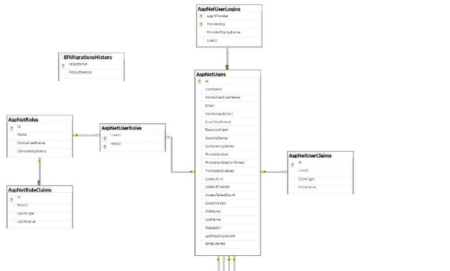**

W dalszej części znajduje się dokumentacja dotycząca aplikacji internetowej Smart Delivery![ref4]

inAteprlinkeatc**W dalszej**ojawa

**Widok rejestracji nowego użytkownika![ref2]**

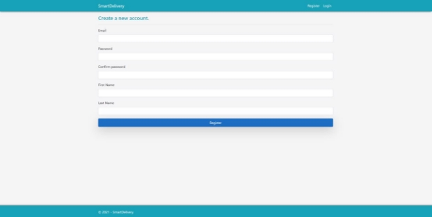

Powyżej znajduje się widok rejestracji, pierwsze rejestrowane konto jest kontem z przyznanymi uprawnieniami administratora.

**Widok panelu logowania![ref2]**

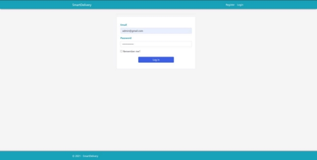

Powyżej znajduje się widok logowania administratora, może on dodawać kategorie, zarządzać użytkownikami, tworzyć restauracje, dodawać pracowników do restauracji.

**Zakres możliwości ![ref3]**

**administratora**

**W dalszej**

**Zakres możliwości administratora![ref2]**

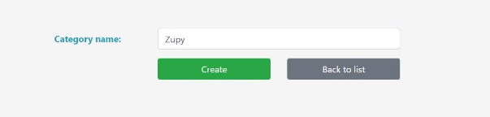

Możliwość dodawania kategorii dań

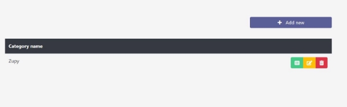

**Przyciski zamieszczone obok nazwy danej kategorii odpowiadają za:**

Zielony przycisk - wyświetlenie informacji szczegółowych dotyczących kategorii Żółty przycisk - edycję kategorii

Czerwony przycisk - usunięcie kategorii

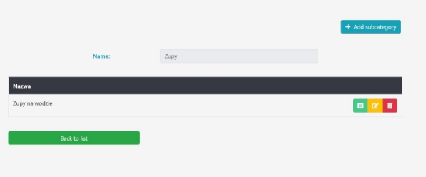

W panelu detali danej kategorii możemy dodać dodatkowo podkategorie.

**Możliwość dodawania  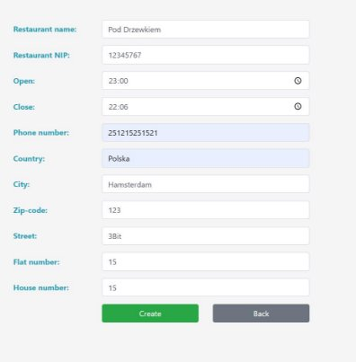nowych restauracji** 

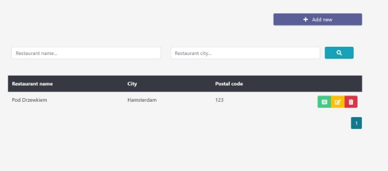

**Lista restauracji oferuje:**

- Wyszukiwanie danej restauracji po nazwie, miejscowości
- Zarządzanie restauracjami za pomocą przycisków umieszczonych obok nazwy placówki 

**Widok danych szczegółowych danej  restauracji umożliwia:** 

- Dodawanie nowych pracowników 
- Wyświetlenie listy aktualnych  pracowników 
- Aktualizowanie danych restauracji 

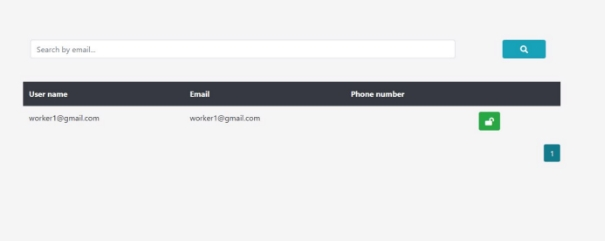

Możliwość blokowania konta pracownika na podstawie listy pracowników

**Zakres możliwości ![ref3]**

**pracownika**

**W dalszej**

**Zakres możliwości pracownika![ref2]**

**Możliwość dodawania  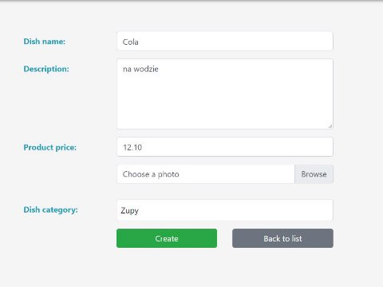nowych potraw** 

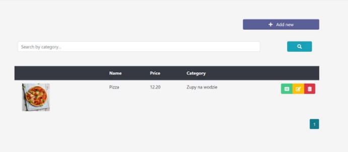

Lista potraw restauracji może być edytowana oraz aktualizowana przez pracownika. 

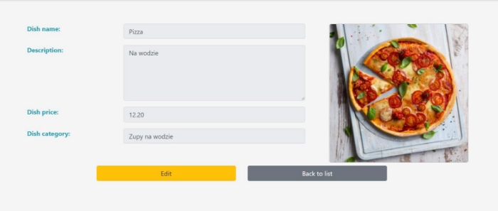

Możliwość zarządzania informacjami dodatkowymi danej potrawy oraz jej aktualizowania.

**Zakres możliwości ![ref3]**

**klienta**

**W dalszej**

**Zakres możliwości klienta![ref2]**

Klient po zarejestrowaniu swojego      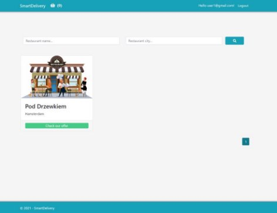konta i zalogowaniu się na nie, zostanie  przekierowany do ekranu startowego  poprzez który ma możliwość            wyszukania interesującej go restauracji  i złożenie zamówienia. 

Po wybraniu           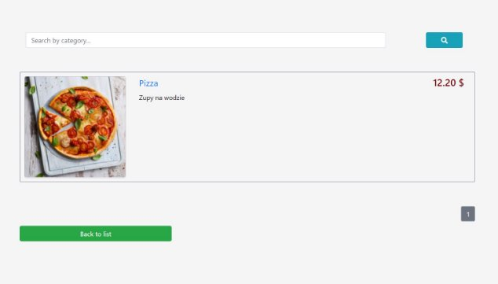interesującego go      lokalu zostanie        przekierowany do      aktualnej oferty danej  restauracji. 

Po wybraniu              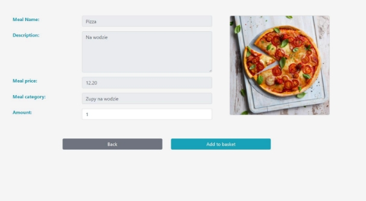interesującego go dania  zostanie przekierowany  do widoku               umożliwiającego dodanie  potrawy do koszyka. 

Jeżeli danie zostanie  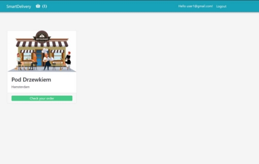poprawnie dodane na  powyższym pasku zmieni  się aktualny stan koszyka. 

Po przejściu do koszyka  ![]./md_imgs/Aspose.Words.43edbb3c-a16e-40c1-9a15-524b83f4fe29.036.jpeg)mamy możliwość         zarządzania jego          zawartością,             kontynuowania zakupów  bądź zrealizowania       zamówienia. 

Podczas składania             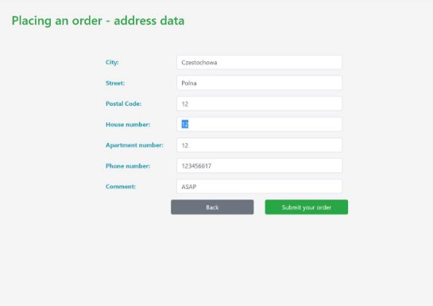zamówienia użytkownik       zostanie poproszony o         wprowadzenie szczegółowych  danych dotyczących adresu  dostawy. 

Aby sukcesywnie zakończyć fazę składania zamówienia użytkownik powinien za nie zapłacić. Płatności realizowane są przy pomocy kodu BLIK.

Jeżeli kod BLIK zostanie przyjęty przez system realizujący płatności, złożenie zamówienia zakończy się sukcesem a zamówienie przejdzie w fazę realizacji. W przypadku gdy zostanie wprowadzony błędny kod BLIK transakcja zostanie odrzucona. 

[ref1]: ./md_imgs/Aspose.Words.43edbb3c-a16e-40c1-9a15-524b83f4fe29.002.png
[ref2]: ./md_imgs/Aspose.Words.43edbb3c-a16e-40c1-9a15-524b83f4fe29.003.png
[ref3]: ./md_imgs/Aspose.Words.43edbb3c-a16e-40c1-9a15-524b83f4fe29.004.png
[ref4]: ./md_imgs/Aspose.Words.43edbb3c-a16e-40c1-9a15-524b83f4fe29.018.png
