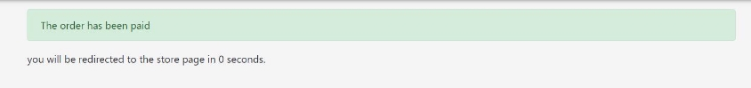

Smart Delivery 

Brief:
The application was created to pass the IT project management course at Częstochowa University of Technology

![ref1]

App concept!

In the era of the current pandemic, access to stationary services to which the gray Smith was accustomed has been hampered. Faced with this problem, I propose to create an application to manage the ordering of food from restaurants. The purpose of this application will be to provide the user with an interface through which he will be able to order for himself any product from any restaurant through the described application, which makes the delivery of goods available in a simple and intuitive way. The project will be implemented with the help of Microsoft technology, namely using the .net core MVC framework, this will allow to quickly achieve a satisfactory result and provide convenience for the programmers taking an active part in the project. Among other things, the application will be based on n-layer architecture, the back-end will be created using c# language and the front-end will be based on Bootstrap css library.

Database schema

Following is the documentation for the Smart Delivery web application

New user registration view

Above is the registration view, the first account to be registered is an account with administrator privileges granted.

View of the login panel

Above is the login view of the administrator, he can add categories, manage users, create restaurants, add employees to restaurants.

The range of capabilities of the administrator

Ability to add categories of dishes

The buttons next to the name of a category are responsible for:

Green button - displaying detailed information about the category Yellow button - editing the category

Red button - deleting a category

In the details panel of a category, we can additionally add subcategories.

Ability to add new restaurants

The restaurant list offers:

- Search for a particular restaurant by name, locality
- Managing restaurants using buttons next to the name of the establishment

The details view of a particular restaurant allows you to:

- Adding new employees 
- Displaying the list of current employees 
- Updating restaurant data

Ability to block an employee's account from the employee list

Range of possibilities for an employee

Ability to add new dishes

 

The restaurant's food list can be edited and updated by the employee.

The ability to manage and update the additional information of a given dish.

The range of possibilities for the customer

The customer, after registering his account and logging into it, will be redirected to the start screen through which he can search for the restaurant he is interested in and place an order     

After selecting the restaurant he is interested in, he will be redirected to the current offer of the restaurant in question.    

After selecting the dish he is interested in, he will be redirected to a view that allows him to add the dish to his shopping cart.             

If the dish is successfully added in the above bar, the current status of the cart will change 

 

Once in the shopping cart, we have the option to manage its contents, continue shopping or complete the order.

When placing an order, you will be asked to enter details of the delivery address.

To successively complete the ordering phase, the user should pay for it. Payments are made using the BLIK code.

If the BLIK code is accepted by the payment processing system, the order placement will be successful and the order will proceed to the processing stage. If an incorrect BLIK code is entered, the transaction will be rejected.

[ref1]: ./md_imgs/Aspose.Words.43edbb3c-a16e-40c1-9a15-524b83f4fe29.002.png
