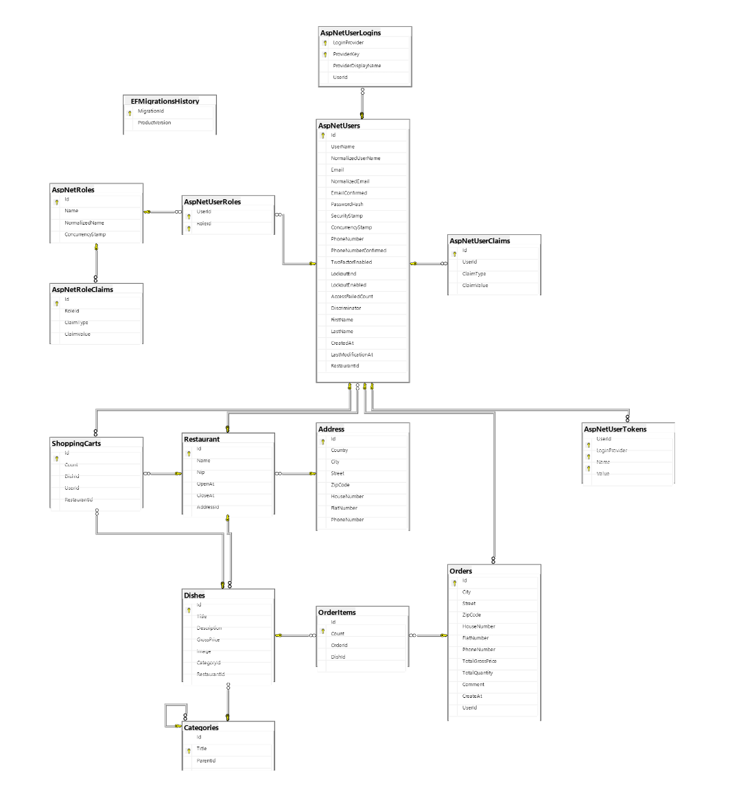
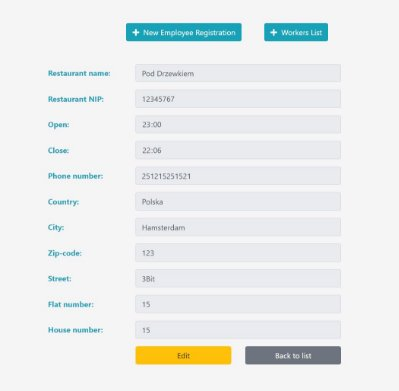

Smart Delivery 

Brief
The application was created to pass the IT project management course at Częstochowa University of Technology

![ref1]

App concept!

In the era of the current pandemic, access to stationary services to which the gray Smith was accustomed has been hampered. Faced with this problem, I propose to create an application to manage the ordering of food from restaurants. The purpose of this application will be to provide the user with an interface through which he will be able to order for himself any product from any restaurant through the described application, which makes the delivery of goods available in a simple and intuitive way. The project will be implemented with the help of Microsoft technology, namely using the .net core MVC framework, this will allow to quickly achieve a satisfactory result and provide convenience for the programmers taking an active part in the project. Among other things, the application will be based on n-layer architecture, the back-end will be created using c# language and the front-end will be based on Bootstrap css library.

Technologies used

HTML (HyperText Markup Language), a hypertext markup language, is one of the most widely used technologies of the Internet. HTML defines the skeleton of the presentation layer provided to the user of a web application. HTML provides a lot of useful markup such as hyperlinks that allow reference to other HTML files, lists, headings, paragraphs and image containers, among others. HTML allows you to specify the appearance of a page, but this is a practice that is not recommended, since cascading style sheets should be responsible for the appearance of an HTML file. Virtually every web application on the client side, which is the web browser, has a structure just based on HTML.

CSS (Cascading Style Sheets) is another of the guiding technologies of the Internet. CSS is responsible for the appearance of a website, it allows you to customize the appearance of your website to meet the current aesthetic standards of a potential application viewer. In the modern web application development process, CSS is an almost indispensable technology, a web application developer may choose to forgo the use of CSS during the process of creating the presentation layer of the application on the client side, which is the browser, but without a legitimate rationale for such a choice, it is likely that the application will be a failure for the sake of an inaccessible interface for the ordinary user. Unlike CSS, a web application developer cannot opt out of using HTML.

JavaScript is undoubtedly a technology that, by current standards for creating convenient, modern and user-friendly web application interfaces, is the primary choice of every developer. JavaScript is a complement to the possibilities that HTML and CSS provide us, unlike these technologies, JavaScript is a full-fledged programming language, which is a multi-paradigm language. JavaScript allows you to write code using object-oriented, functional or imperative paradigms, among others. JavaScript is responsible for the logic executed on the browser side. Since the early days of the Internet's development, the JavaScript programming language has been the primary and essentially the only choice for creating view logic for Web applications, which has led to a situation where, knowledge of JavaScript is fundamental for anyone who wants to participate in the Internet development process.

JQuery is a lightweight JavaScript library that aims to make JavaScript easier to use, by providing solutions that allow for DOM tree manipulation, animation creation, AJAX support or dynamic changes to a page, among other things, in a simpler way than in JavaScript. Unfortunately, compared to JavaScript, jQuery performs worse in terms of optimization, using this technology, we lose performance relative to writing code in pure JavaScript, this is due to the redundant code that is provided by the library.

Bootstrap is a CSS library providing the user of this library with ready-made classes and solutions. Bootstrap was created by the developers of the Twitter platform to facilitate the creation of user interfaces by developers, it is released under the MIT license, which gives users unlimited rights to use Bootstrap. In combination with JQuery, a user of these technologies is able to quickly and easily create an eye-pleasing and aesthetically pleasing visual layer of an application. The downside of using Bootstap is undoubtedly a decrease in performance compared to self-written style sheets, this situation is caused, as in the case of JQuery, by the fact that we are not able to use all the solutions provided by the library, which undoubtedly translates into redundant and unnecessary mechanisms that we do not need. When using Bootstrap, it is worth bearing in mind the decrease in the originality of the appearance of the site and the performance of the application.

C# is a multi-paradigm programming language. C# is Microsoft's answer to the growing popularity of the Java programming language. Programs written in C# are compiled into Common Intermediate Language, a language that is very close to machine language. The main paradigm in C# is the object-oriented paradigm. Initially, programs written in C# were single-platform, with Microsoft limiting the scope of the language essentially only to its creations such as Windows, but C# is now a multi-platform language. Microsoft has taken it upon itself to add many new features to the language from, among other things, the function paradigm which, combined with friendly syntax, the lifting of the language's restriction on the platform on which it can be used and the convenient free VisualStudio environment, has led to a situation where C# is currently one of the most popular programming languages on the commercial market. C# is part of the .Net platform.

 
ASP.NET Core MVC is a cross-platform web application development platform developed by Microsoft. The premise of ASP.NET Core MVC is to make the developer's job easier by providing him with a ready-made solution and a structure on which he can build applications. ASP.NET Core MVC is based on the Model-View- Controller (MVC) pattern. The purpose of the MVC pattern is to separate applications into layers such as models, views and controllers. Views are responsible for the presentation layer, this is the layer that the application user works with, in the described platform in the view layer it is common to use views based on the Razor engine. The model layer in MVC is responsible for the representation of the application state and business logic. The controller layer is intended to handle requests, perform operations on the domain model, and decide which views will be made available to the application user, so the controller is an intermediate layer between the model and the view.

SQL (Structured Query Language) is a structured query language used to operate on a database. SQL allows the creation, modification or deletion of tables, as well as the manipulation of data records through operations such as adding, deleting or editing records. SQL is a programming language based on the declarative paradigm, this means that the programmer must describe what conditions the final solution should meet, rather than the steps that should be taken in obtaining a positive result as in the case of the imperative paradigm.

EntityFramework Core is a tool that enables object-relational mapping this is called ORM (object-relational mapping). EntityFramework's task is to provide entities that are compatible with tables in databases. Familiarity with EntityFramework enables the programmer to work at a higher level of abstraction, eliminates to a large extent the need to write more code to perform operations on data, resulting in a situation where even a person inexperienced in working with a database is able through EntityFramework to work efficiently with it.

Tools used

Microsoft Visual Studio is an integrated development environment created by Microsoft. It was created to streamline the work of programmers by providing them with a convenient interface for developing and testing software. Among other things, it has an integrated debugger, which is a tool that allows dynamic analysis of programs to look for errors, another of the default solutions implemented into Visual Studio is the Git environment, which is designed to support, among other things, the work of teams of developers by providing them with an interface for sharing code. Microsoft Visual Studio is often used to develop software that has a graphical panel designed to support the work of the application user, as well as to create APIs or console applications. It allows you to create Windows Form, WPF, mobile applications, console applications or web applications using the ASP platform, among others.

Microsoft Sql Server Management Studio is an integrated environment for supporting the management of components included in Microsoft SQL Server such as databases, among others. It is a tool that allows convenient manipulation of databases by using the basic query language of this architecture, which is T-SQL.

Database schema

Following is the documentation for the Smart Delivery web application

New user registration view

Above is the registration view, the first account to be registered is an account with administrator privileges granted.

View of the login panel

Above is the login view of the administrator, he can add categories, manage users, create restaurants, add employees to restaurants.

The range of capabilities of the administrator

Ability to add categories of dishes

The buttons next to the name of a category are responsible for:

Green button - displaying detailed information about the category Yellow button - editing the category

Red button - deleting a category

In the details panel of a category, we can additionally add subcategories.

Ability to add new restaurants

The restaurant list offers:

- Search for a particular restaurant by name, locality
- Managing restaurants using buttons next to the name of the establishment

The details view of a particular restaurant allows you to:

- Adding new employees 
- Displaying the list of current employees 
- Updating restaurant data

Ability to block an employee's account from the employee list

Range of possibilities for an employee

Ability to add new dishes

 

The restaurant's food list can be edited and updated by the employee.

The ability to manage and update the additional information of a given dish.

The range of possibilities for the customer

The customer, after registering his account and logging into it, will be redirected to the start screen through which he can search for the restaurant he is interested in and place an order     

After selecting the restaurant he is interested in, he will be redirected to the current offer of the restaurant in question.    

After selecting the dish he is interested in, he will be redirected to a view that allows him to add the dish to his shopping cart.             

If the dish is successfully added in the above bar, the current status of the cart will change 

 

Once in the shopping cart, we have the option to manage its contents, continue shopping or complete the order.

When placing an order, you will be asked to enter details of the delivery address.

To successively complete the ordering phase, the user should pay for it. Payments are made using the BLIK code.

If the BLIK code is accepted by the payment processing system, the order placement will be successful and the order will proceed to the processing stage. If an incorrect BLIK code is entered, the transaction will be rejected.

[ref1]: ./md_imgs/Aspose.Words.43edbb3c-a16e-40c1-9a15-524b83f4fe29.002.png
